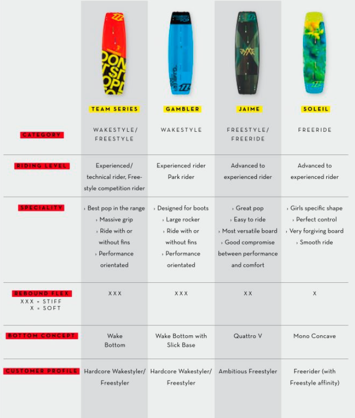

# FIRSTPAGE
> Le TP doit respecter les normes et les standards du WEB (ex. https://www.w3.org/ et https://checklists.opquast.com/fr/)

## Mise en situation
La *Web agency* **"Orély"** souhaite de nouveau tester vos capacités en HTML et CSS. Pour cela, elle a besoin que vous reproduisiez à l'identique un élément d'un site web. C'est la dernière fois, promis ;) !!    

Il s'agit d'un tableau de comparaison d'une site de Kitesurf : **Duotone** anciennement North.  

  
***(Désolé de la la qualité)***

## Structure du dossier
Le dossier de ce test sera composé de cette manière :
* index.html
* assets
    * img
        * images_du_site
    * css
        * style.css

## Contraintes du test
* Une feuille de style obligatoire ( *style.css* ) : **Pas de balise ou attribut style** dans votre page html.
* Les images principales se trouves dans le dossier du TP **img**.
* Utilisation de l'anglais de lors de création de vos **class** et de vos **id**.
* Un code **propre** avec une belle **indentation** pour plus de lisibilité.
* Utilisation de https://www.fontsquirrel.com/matcherator pour déterminer les polices d'écriture.
* Utilisation d'un color picker pour les couleurs : ex. **Colorpick eyedropper** sous Chrome.

## A VOUS DE CODER !!
> L'agence **Orély** compte sur vous !
